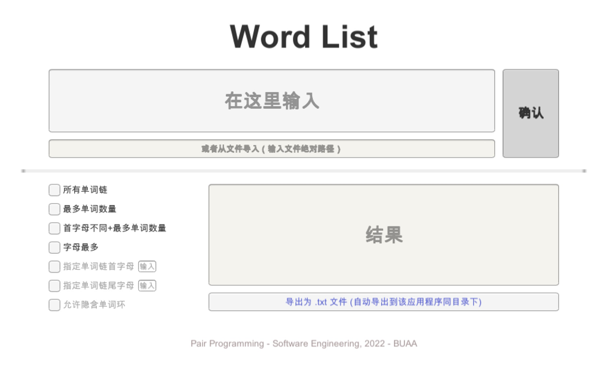

# WordList应用程序使用指南

## 下载并运行

MacOS用户：下载后直接打开`WordList`运行即可。

Windows用户：下载后解压`WordList.zip`，进入运行`WordList.exe`。

## 使用说明

* 该图形化界面支持**直接手动输入**单词文本，也可以通过**输入文件的绝对路径**来导入文件内容。
* 在点击“确认”**之前**，请先选择单词链生成选项。特定选项之间允许组合。要指定单词链首尾字母，先选择对应选项后，在选项后的输入框内输入一个**英文字母**，然后点击确认。
* 要**导出**结果为`.txt`文件的话，则点击导出按钮后，生成的文件会默认保存在同`WordList`的目录下。
* 如果有**异常情况**出现，如文件不存在或操作不规范等，在**结果框内**会给出相应报错提示。